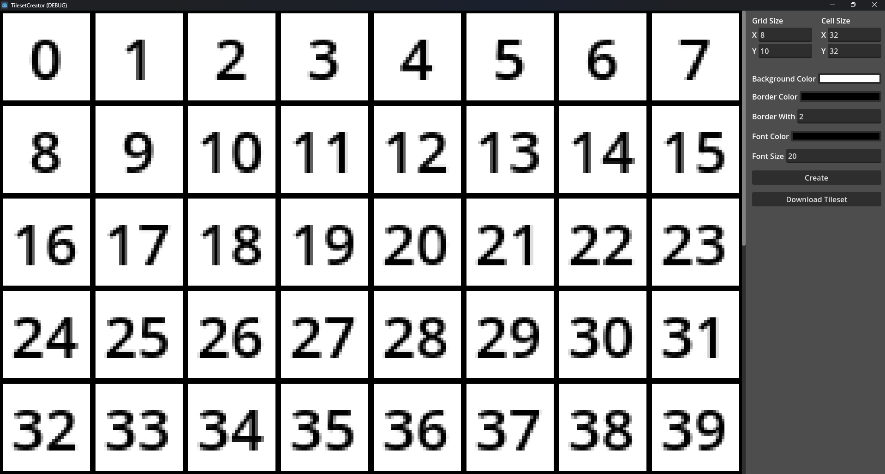
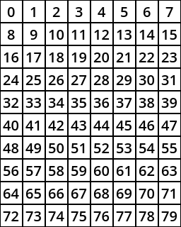
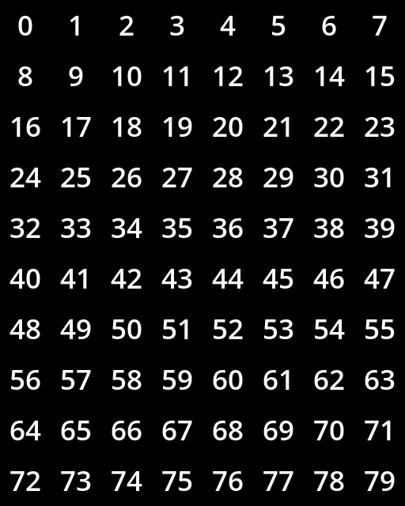
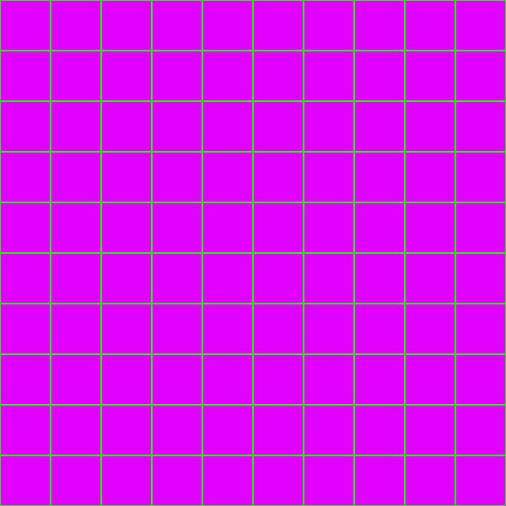

# TilesetCreator
 Simple Godot app to create tilesets.

Godot version: `4.2.1`

Example of Tilesets to Create:

|  |  |  |
|:--------------------------------------------------------:|:----------------------------------------------------------:|:--------------------------------------------------:|
| Tileset 8x10 Tile Size: (32x32)                          | Tileset 8x10 Tile Size: (64x64)                            | Grid 8x8                                           |

